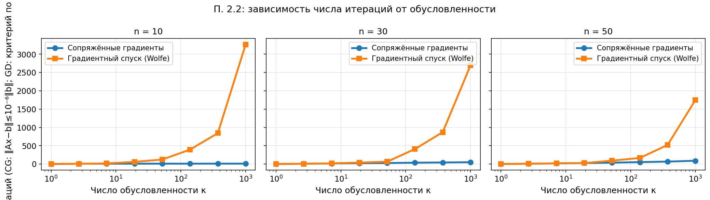

# Раздел 2.2. Зависимость числа итераций CG от обусловленности

Ноутбук: `notebooks/experiment_2_2.ipynb`. Методичка: `лаб2.pdf`, п. 2.2.

## а) Постановка задачи

На семействе SPD-квадратических функций с ростом числа обусловленности κ сравнить число итераций **линейного** метода сопряжённых градиентов (решение `Ax=b`, критерий по невязке) и **градиентного спуска** с линейным поиском Вольфа на эквивалентной задаче минимизации `0.5 xᵀAx - bᵀx`.

## б) Параметры

Размерности `n ∈ {10, 30, 50}`; κ по логарифмической сетке от 1 до 1000; спектр `A` — `geomspace(1, κ)` после случайного ортогонального преобразования; для GD — относительный критерий по квадрату нормы градиента `10⁻⁶`.

## в) Графики

`exp22_cg_vs_gd.pdf` / `exp22_cg_vs_gd.png`:

## г) Выводы

Число итераций CG растёт с κ существенно медленнее, чем у градиентного спуска, что согласуется с теорией для квадратичных задач.

## д) Ответы на вопросы методички (2.2)

1. **Сравнение с ГС:** на плохо обусловленных квадратических функциях GD требует намного больше итераций; CG использует сопряжённость направлений относительно `A`.
2. **Выводы:** CG как прямой решатель `Ax=b` масштабируется с обусловленностью лучше, чем первый порядок на той же квадратической функции.
