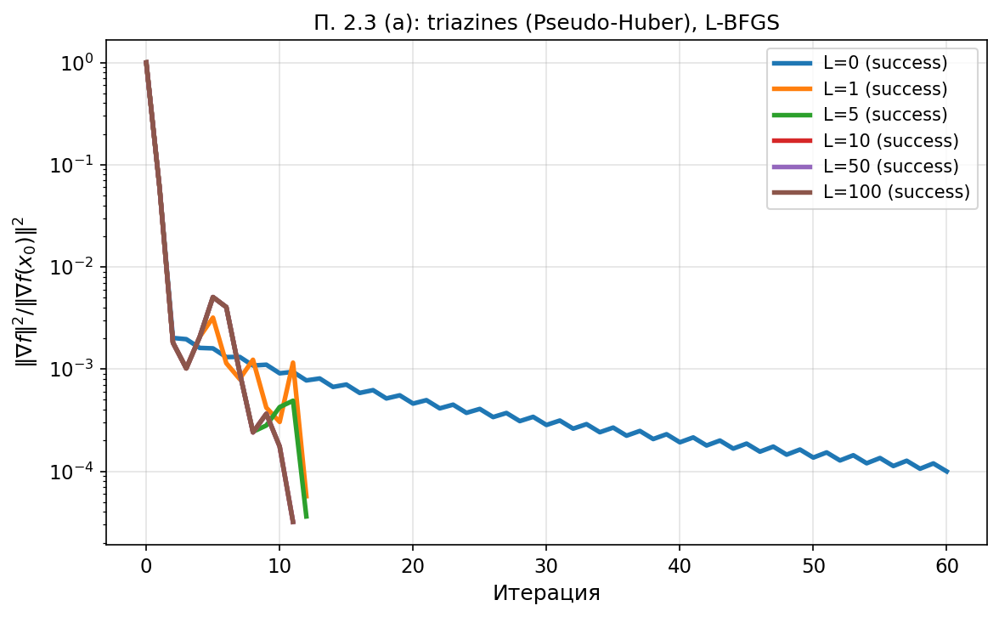
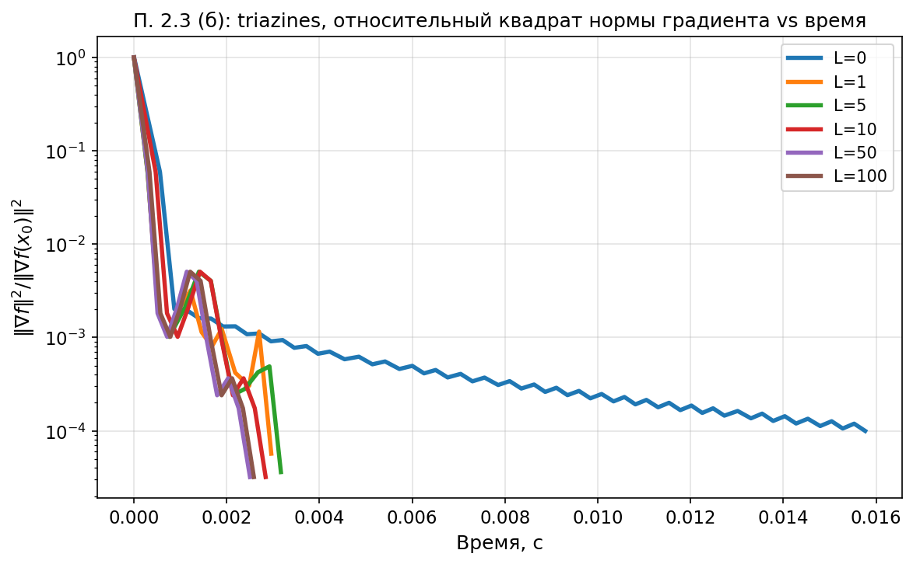
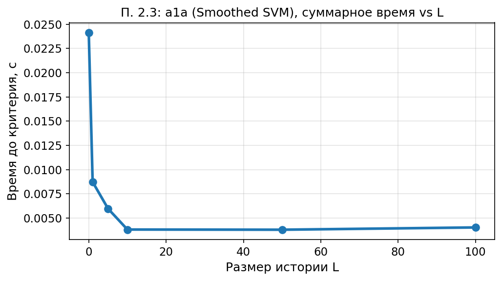
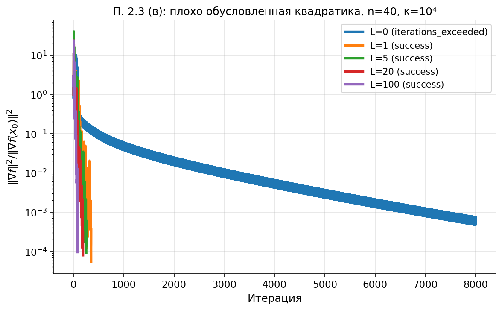

# Раздел 2.3. Размер истории L-BFGS

Ноутбук: `notebooks/experiment_2_3.ipynb`. Методичка: `лаб2.pdf`, п. 2.3.

## а) Постановка задачи

Исследовать влияние размера истории `L` на сходимость L-BFGS на ML-оракулах варианта; оценить память и сложность итерации `O(nL)` (без учёта оракула); дополнительно — плохо обусловленная квадратичная задача (вопрос 3 подпункта 2.3).

## б) Параметры

`λ = 1/m`, `x₀ = 0`, `L ∈ {0,1,5,10,50,100}`, критерий остановки `10⁻⁴` по относительному квадрату нормы градиента. Регрессия: `triazines_scale` (Pseudo-Huber). Классификация для графика времени vs `L`: `a1a` (Smoothed SVM). Квадратика: `n=40`, κ=`10⁴`.

## в) Графики

`exp23_triazines_mem.png`:

`exp23_triazines_mem_time.png`:

`exp23_a1a_time_vs_L.png`:

`exp23_badly_conditioned_quad.png`:

## г) Выводы

При малых `L` рост памяти даёт заметный выигрыш, при очень больших `L` выигрыш по итерациям насыщается, а стоимость шага растёт. На плохо обусловленной квадратической функции большие `L` полезнее, чем на «лёгкой» задаче.

## д) Ответы на вопросы методички (2.3)

1. **Плато:** наблюдается после `L` порядка десятков для данных размерностей; с ростом `n` роль большей памяти может усиливаться.
2. **«Золотая середина»:** L=10; слишком большое `L` замедляет двухцикловую рекурсию.
3. **Скоррелированные признаки:** на искусственной плохо обусловленной квадратической функции (рис. 2.3г) видно, что GD-подобный режим `L=0` хуже, нужны большие `L`.
4. **Минимальная история:** даже `L=1` заметно ускоряет относительно `L=0` на triazines (см. семейство кривых на рис. 2.3а).
