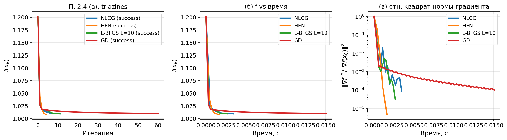

# Раздел 2.4. Сравнение методов на ML

Ноутбук: `notebooks/experiment_2_4.ipynb`. Методичка: `лаб2.pdf`, п. 2.4.

## а) Постановка задачи

Сравнить нелинейный CG, усечённый Ньютон (HFN), L-BFGS (`L=10`) и градиентный спуск с `x₀=0`, `λ=1/m`, линейный поиск Вольфа. Во всех ML-методах используется только операция `hess_vec`, без явного построения гессиана.

## б) Параметры

Датасет: `triazines_scale`, Pseudo-Huber. Критерий: относительный квадрат нормы градиента `10⁻⁴`.

## в) Графики

`exp24_triazines_methods.png`:

## г) Выводы

На текущем запуске на `triazines_scale` метод HFN оказался лучшим и по числу внешних итераций, и по времени. L-BFGS и NLCG тоже заметно лучше GD по числу шагов, а сам GD требует существенно больше итераций. При этом общий вывод остаётся прежним: преимущество HFN по времени зависит от стоимости внутренних вызовов `hess_vec`, поэтому на других задачах лидер по итерациям и лидер по времени могут различаться.

## д) Ответы на вопросы методички (2.4)

1. **Итерации vs время:** лидеры могут различаться: у HFN дорогая итерация при малом числе шагов.
В текущем эксперименте лидер совпал по обоим критериям: HFN сделал меньше всех внешних шагов и завершился быстрее остальных методов.
2. **Широкие vs высокие данные:** `triazines_scale` — случай, где `m` и `n` сопоставимы; при `n≫m` стоимость одного `hess_vec` относительно размерности ниже, поэтому HFN может выглядеть выгоднее.
3. **Сравнение с лаб. 1:** прямого сопоставления с полным Ньютоном здесь нет, так как во второй лабе на ML-задачах запрещён явный гессиан. По смыслу HFN и L-BFGS занимают промежуточное положение между GD и полным методом второго порядка.
