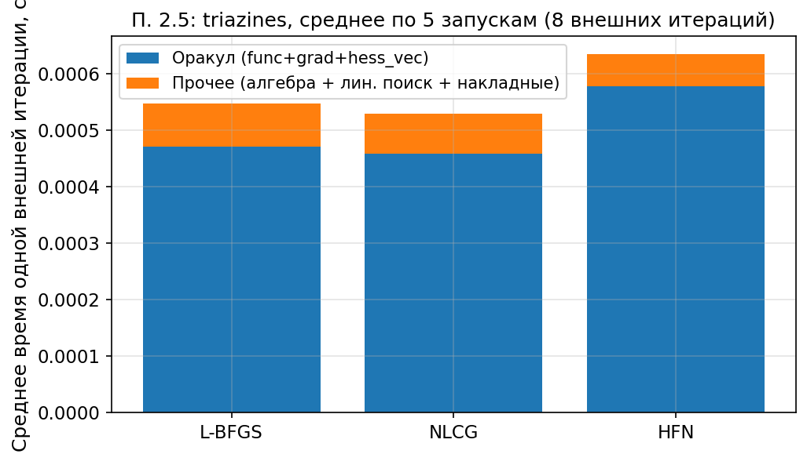

# Раздел 2.5. Микропрофилирование

Ноутбук: `notebooks/experiment_2_5.ipynb`. Методичка: `лаб2.pdf`, п. 2.5.

## а) Постановка задачи

Оценить, какая доля времени одной внешней итерации уходит на оракул (`func`/`grad`/`hess_vec`, включая вызовы из линейного поиска) и на остальное (алгебра метода, накладные расходы линейного поиска, не отнесённые к таймеру оракула).

## б) Реализация

Обёртка `TimedOracle` суммирует время в `func`, `grad`, `hess_vec`. Усреднение по 5 прогонам по 8 внешним итерациям с пониженным порогом (`10⁻²`), чтобы стабильно измерять «типичную» итерацию.

## в) Графики

`exp25_micro_profile.png`:

## г) Выводы

Во всех трёх методах основную часть времени даёт именно оракул. На текущем запуске его доля составляет около `88%` у L-BFGS, `87%` у NLCG и `92%` у HFN. У HFN эта доля максимальна из-за внутренних вызовов `hess_vec` в CG.

## д) Ответы на вопросы методички (2.5)

1. **Линейный поиск:** на triazines заметная часть стоимости линейного поиска уже попадает в счётчик оракула через вызовы `func` и `grad`; оставшееся «прочее» сравнительно невелико и включает служебную алгебру метода и накладные расходы реализации Wolfe.
2. **`n≫m`:** один `hess_vec` дешевле в размерности по `n`; при этом число внутренних итераций CG может остаться большим — сравнение с L-BFGS зависит от задачи.
