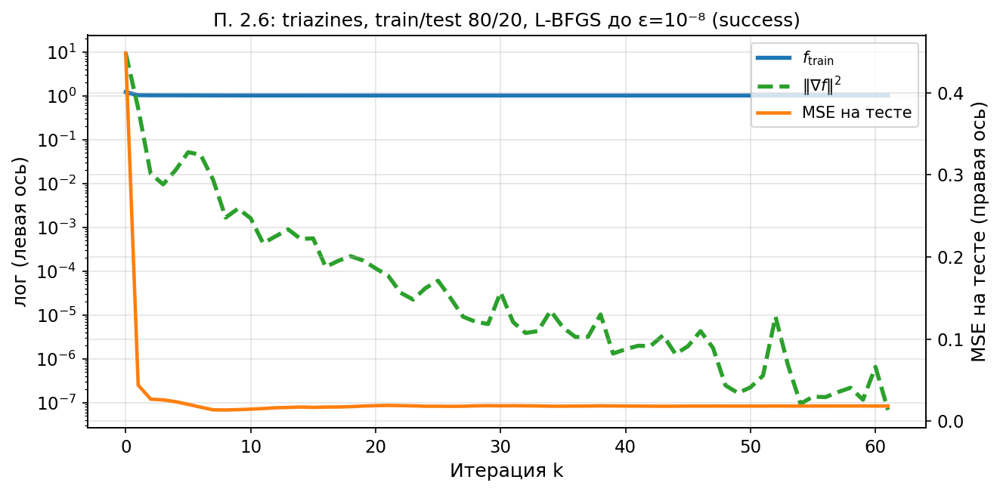

# Раздел 2.6. Точность оптимизации и качество на тесте

Ноутбук: `notebooks/experiment_2_6.ipynb`. Методичка: `лаб2.pdf`, п. 2.6.

## а) Постановка задачи

Разделить `triazines_scale` на train/test **80/20**, обучать Pseudo-Huber с `λ=1/m` на train. L-BFGS до `ε=10⁻⁸` (относительный квадрат нормы градиента). На каждой итерации фиксировать `f_train`, `‖∇f‖²` и **MSE на тесте** (через сохранение `x_k`, параметр `store_xk=True` в `lbfgs`).

## б) Параметры

`memory_size=20`, Вольф, `x₀=0`.

## в) Графики

`exp26_triazines_train_test.png`:

## г) Выводы

В текущем запуске тестовая MSE достигает минимума уже на ранней стадии, после чего train-loss и норма градиента продолжают уменьшаться, а качество на тесте не улучшается и даже слегка ухудшается. Это наглядный пример того, что доводить задачу до очень малого градиента полезно не всегда.

## д) Ответы на вопросы методички (2.6)

1. **Плато теста:** по текущему графику минимум тестовой MSE достигается примерно к `k≈8`; после этого видимого улучшения уже нет, хотя `f_train` продолжает убывать.
2. **«Бесполезная» оптимизация:** почти всё время после ранних итераций уходит на дооптимизацию train-loss без выигрыша на тесте; это и есть количественная иллюстрация пользы ранней остановки.
3. **Влияние λ:** при уменьшении `λ` задача становится менее регуляризованной, а при увеличении `λ` решение сильнее сглаживается; это должно отражаться и на скорости оптимизации, и на тестовой ошибке.
