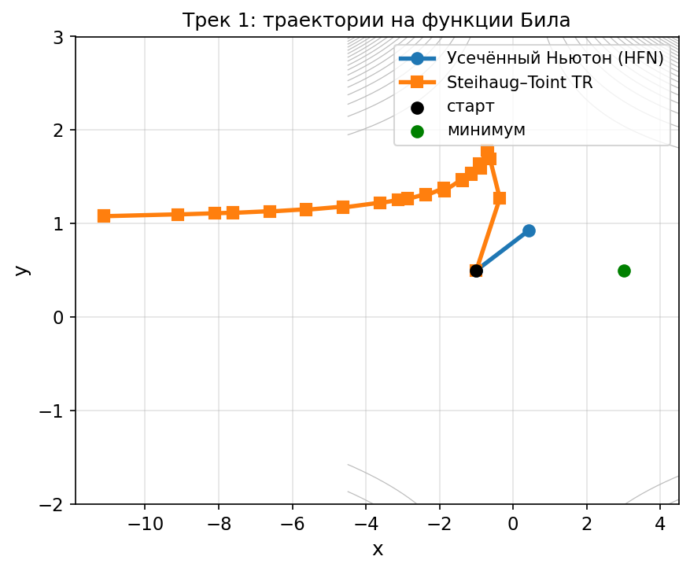
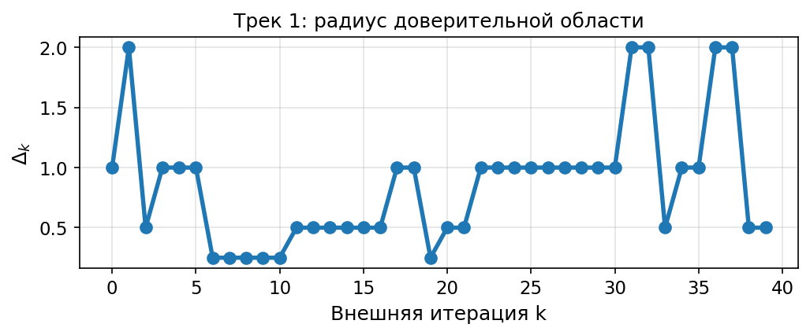
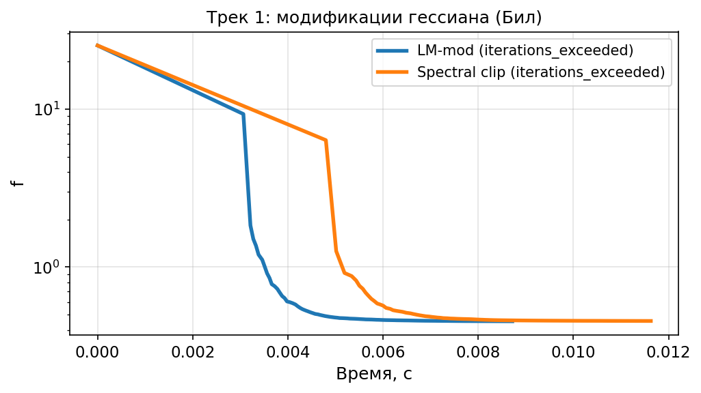

# Трек 1. Steihaug–Toint и отрицательная кривизна

Ноутбук: `notebooks/experiment_track1.ipynb`. Методичка: `лаб2.pdf`, прилож. А; дополнительно — сравнение модификаций гессиана (LM и spectral) на функции Била.

## а) Постановка задачи

Реализованы внутренний метод Steihaug–Toint для квадратичной модели в доверительной области и внешнее обновление радиуса `Δ_k` по коэффициенту согласия `ρ_k`. Сравниваются **HFN + Wolfe** и **TR Steihaug–Toint** на функции Била из стартовой точки вблизи сложной зоны. Для ML-части дополнительно рассмотрен случай **λ=0** на `triazines_scale`, чтобы показать влияние отсутствия регуляризации. Отдельно на функции Била сравниваются модификации Ньютона с LM и спектральным исправлением гессиана.

## б) Параметры

Бил: старт `(-1, 0.5)`, допуск `10⁻⁶`. TR: `Δ₀=1`. Ньютон с модификациями: Вольф, допуск `10⁻⁸`.

## в) Графики

`exp_t1_beale_traj.png`:

`exp_t1_delta.png`:

`exp_t1_hessian_mod_beale.png`:

## г) Выводы

На выбранной стартовой точке HFN с линейным поиском быстро сталкивается с проблемой спуска и останавливается почти сразу, тогда как trust-region вариант со Steihaug–Toint делает устойчивую последовательность шагов с адаптацией радиуса `Δ_k` и заметно уменьшает значение функции. При этом с данной инициализацией TR не приходит к глобальному минимуму Била, поэтому здесь важен именно вывод о большей устойчивости в невыпуклой области, а не о глобальной сходимости.

## д) Ответы на вопросы трека (прилож. А + модификации)

1. **Траектории:** на рис. Т1.1 видно различие подходов к сложной геометрии; HFN почти сразу прекращает движение, а TR продолжает продвигаться за счёт ограничения шага и обработки отрицательной кривизны.
2. **Δ_k:** на рис. Т1.2 видно чередование сжатий и расширений радиуса доверительной области в зависимости от качества локальной квадратичной модели.
3. **`triazines_scale`, λ=0:** без L2-регуляризации задача хуже обусловлена, поэтому поведение метода становится менее устойчивым.
